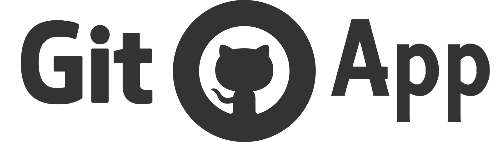

# GitApp

A simple app for working on github.com

# Features
 - Auto Updating to latest github release
 - Clean delivery of github
 - Easy use
 - Clean UI

# [Download](https://github.com/dan-online/GitApp/releases)

All downloads are [here](https://github.com/dan-online/GitApp/releases)

### Supported devices
 - MacOS
 - Windows
 - Linux
 - Android

# To-Do
 - ~Android App~
 - Styling the app

# Collaborate
 - All pull requests are welcome
 - Also issues
 
## Help
If you know how to make an iOS app, that would be very welcome!

# Contact
You can contact me with [email](mailto:dan@dancodes.online)

# Development

### Starting in development
```bash
$ npm install
$ npm start
```

### Building
#### Desktop
```bash
$ cd Desktop; build --mac/--windows/--linux
```
#### Android
```bash
$ cd Android; npm run package;
```
